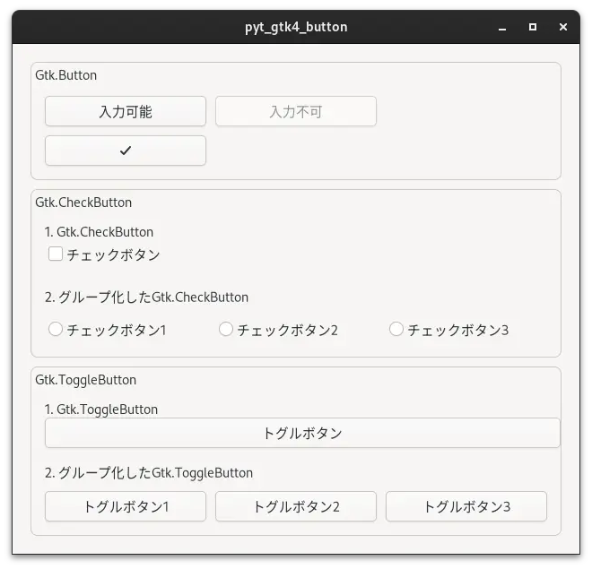

# pyt_gtk4_button

 

## 内容 

Gtk.Button、Gtk.CheckButton、Gtk.ToggleButtonを使用するプログラムです。  

 

Gtk.Button:       ①通常のものとvisible、sensitiveをFalseにしたボタンを配置。②ラベルにアイコンを配置したボタンの作成  
Gtk.CheckButton:  ①チェックボタンの作成と②チェックボタンをグループ化  
Gtk.ToggleButton:  ①トグルボタンの作成と②トグルボタンをグループ化  

 

## 履歴

2024/6/10 プログラム作成

 

## 参考にしたHP
